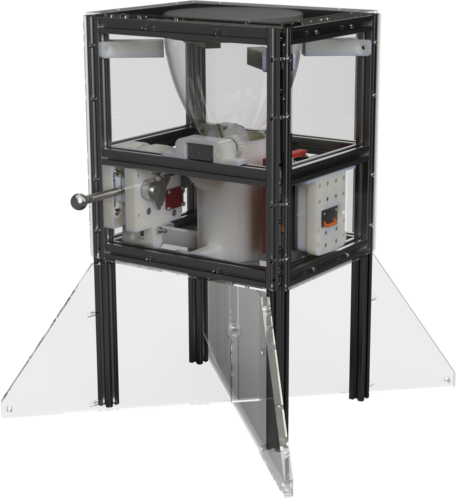
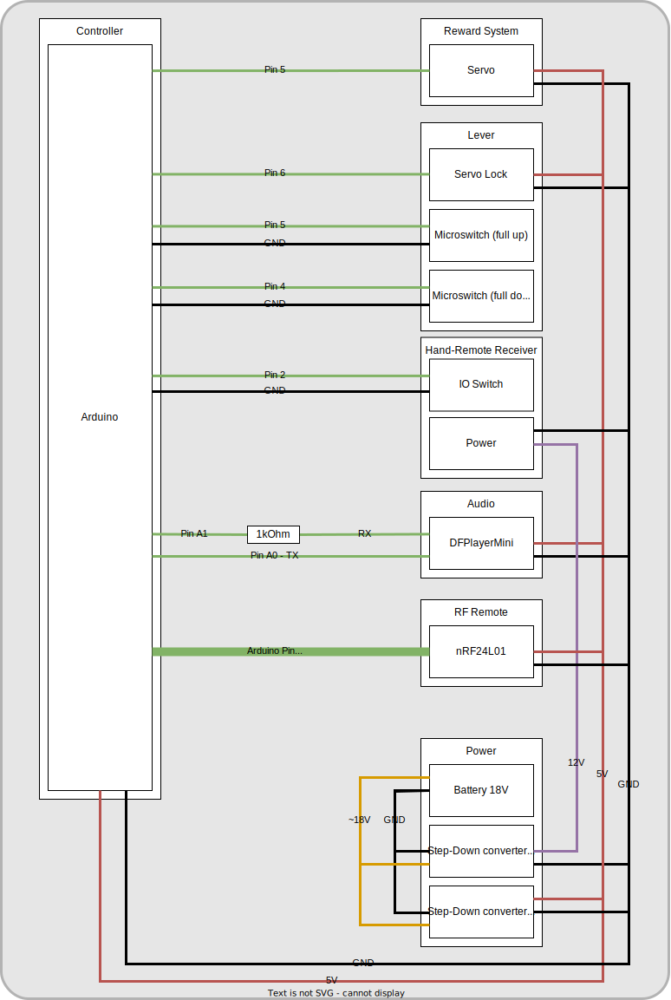

# Hardware

## Publication

Repository: Zenodo  
Publication date: 2024-11-18 | Journal article  
DOI: [10.5281/zenodo.14178666](https://www.doi.org/10.5281/zenodo.14178666)  

## Electrical wireing

## Manufacturing

The files for manufacturing can be found in the following folders:

+ STL/: Contains the STL files for 3D printing the parts.
+ Panels/: Contains the files for cutting the panels.
+ PDF/: Contains the files with specifications, turning and assembly instructions.

Alternatively, you can export all parts from the provided full assemblies with either the `ApparatusAssembly.step` or `ApparatusAssembly.f3z` files.

## BOM

From `BOM.xlsx`:

| Category                   | Quantity  One apparatus | Quantity four apparatuses | Wear and tear | Amount to order | Type / Length mm                   | Component                                                                                    | Supplier                   | URL                                                                                                                                                                            | Price @ URL | Price for one apparatus. | Price for two apparatus. | Price waer and tear | Price total | Comment                                |
| -------------------------- | ----------------------- | ------------------------- | ------------- | --------------- | ---------------------------------- | -------------------------------------------------------------------------------------------- | -------------------------- | ------------------------------------------------------------------------------------------------------------------------------------------------------------------------------ | ----------- | ------------------------ | ------------------------ | ------------------- | ----------- | -------------------------------------- |
| Housing                    | 100                     | 400                       | 0             | 400             | M5                                 | Nutenstein mit Steg I-Typ Nut 5 [M5]                                                         | Motedis                    | https://www.motedis.com/shop/Nutprofil-Zubehoer/Zubehoer-20-I-Typ-Nut-5/Nutensteine-passend-fuer-Nut-5-I-Typ/Nutenstein-mit-Steg-I-Typ-Nut-5-M5::4226.html                     | 0,18 €      | 18,16 €                  | 72,64 €                  | 0,00 €              | 72,64 €     |                                        |
| Housing                    | 4                       | 16                        | 0             | 16              | 500mm                              | Aluprofil 20x20 I-Typ Nut 5                                                                  | Motedis                    | https://www.motedis.com/shop/Aluprofile/20-I-Typ-Nut-5/Aluprofil-20x20-I-Typ-Nut-5::1076.html                                                                                  | 2,96 €      | 11,82 €                  | 47,28 €                  | 0,00 €              | 47,28 €     |                                        |
| Housing                    | 8                       | 32                        | 2             | 34              | 180mm, machining M5 L/R            | Aluprofil 20x20 I-Typ Nut 5                                                                  | Motedis                    | https://www.motedis.com/shop/Aluprofile/20-I-Typ-Nut-5/Aluprofil-20x20-I-Typ-Nut-5::1076.html                                                                                  | 2,90 €      | 23,20 €                  | 92,80 €                  | 5,80 €              | 98,60 €     |                                        |
| Housing                    | 8                       | 32                        | 2             | 34              | 240mm, machining M5 L/R            | Aluprofil 20x20 I-Typ Nut 5                                                                  | Motedis                    | https://www.motedis.com/shop/Aluprofile/20-I-Typ-Nut-5/Aluprofil-20x20-I-Typ-Nut-5::1076.html                                                                                  | 3,17 €      | 25,32 €                  | 101,28 €                 | 6,33 €              | 107,61 €    |                                        |
| Housing                    | 16                      | 64                        | 4             | 68              | 20x20 mm                           | Stahlwinkel 20 verzinkt                                                                      | Motedis                    | https://www.motedis.com/shop/Test2-Systematic/Gabelkoepfe-Gabelgelenke/Stahlwinkel-20-verzinkt::9014.html                                                                      | 0,72 €      | 11,52 €                  | 46,08 €                  | 2,88 €              | 48,96 €     |                                        |
| Housing                    | 56                      | 224                       | 15            | 239             | M5x6                               | Schraube DIN EN ISO 7380 - Linsenkopfschraube                                                | Motedis                    | https://www.motedis.com/shop/Mechanik-Basiselemente/DIN-Schrauben/Schraube-DIN-EN-ISO-7380-Linsenkopfschraube::1070.html                                                       | 0,15 €      | 8,42 €                   | 33,69 €                  | 2,26 €              | 35,95 €     |                                        |
| Housing                    | 56                      | 224                       | 15            | 239             | M5x8                               | Schraube DIN EN ISO 7380 - Linsenkopfschraube                                                | Motedis                    | https://www.motedis.com/shop/Mechanik-Basiselemente/DIN-Schrauben/Schraube-DIN-EN-ISO-7380-Linsenkopfschraube::1070.html                                                       | 0,15 €      | 8,42 €                   | 33,69 €                  | 2,26 €              | 35,95 €     |                                        |
| Housing                    | 56                      | 224                       | 15            | 239             | M5x10                              | Schraube DIN EN ISO 7380 - Linsenkopfschraube                                                | Motedis                    | https://www.motedis.com/shop/Mechanik-Basiselemente/DIN-Schrauben/Schraube-DIN-EN-ISO-7380-Linsenkopfschraube::1070.html                                                       | 0,15 €      | 8,42 €                   | 33,69 €                  | 2,26 €              | 35,95 €     |                                        |
| Housing                    | 56                      | 224                       | 15            | 239             | M5x12                              | Schraube DIN EN ISO 7380 - Linsenkopfschraube                                                | Motedis                    | https://www.motedis.com/shop/Mechanik-Basiselemente/DIN-Schrauben/Schraube-DIN-EN-ISO-7380-Linsenkopfschraube::1070.html                                                       | 0,15 €      | 8,42 €                   | 33,69 €                  | 2,26 €              | 35,95 €     |                                        |
| Housing                    | 0                       | 0                         | 0             | 0               | M5x12                              | Befestigungsschraube DIN 7380 M5x12 vz für Standardverbinder Nut 5 I-Typ                     | Motedis                    | https://www.motedis.com/shop/Nutprofil-Zubehoer/Zubehoer-20-I-Typ-Nut-5/Verbinder-Winkel/Befestigungsschraube-DIN-7380-M5x12-vz-f%FCr-Standardverbinder-Nut-5-I-Typ::5972.html | 0,11 €      | 0,00 €                   | 0,00 €                   | 0,00 €              | 0,00 €      |                                        |
| Housing                    | 20                      | 80                        | 15            | 95              | M5x16                              | Schraube DIN EN ISO 7380 - Linsenkopfschraube                                                | Motedis                    | https://www.motedis.com/shop/Mechanik-Basiselemente/DIN-Schrauben/Schraube-DIN-EN-ISO-7380-Linsenkopfschraube::1070.html                                                       | 0,15 €      | 3,01 €                   | 12,03 €                  | 2,26 €              | 14,29 €     |                                        |
| Housing                    | 0                       | 0                         | 0             | 0               | 35x220mm                           | DIN 35 – Hutschiene                                                                          | Digikey                    | https://www.digikey.de/product-detail/de/banner-engineering-corporation/DIN-35-220/2170-DIN-35-220-ND/12417670                                                                 | 18,25 €     | 0,00 €                   | 0,00 €                   | 0,00 €              | 0,00 €      |                                        |
| Housing                    | 10                      | 40                        | 15            | 55              | M5x35                              | Schraube DIN EN ISO 7380 - Linsenkopfschraube                                                | Motedis                    | https://www.motedis.com/shop/Mechanik-Basiselemente/DIN-Schrauben/Schraube-DIN-EN-ISO-7380-Linsenkopfschraube::1070.html                                                       | 0,39 €      | 3,90 €                   | 15,58 €                  | 5,84 €              | 21,43 €     |                                        |
|                            |                         |                           |               |                 |                                    |                                                                                              |                            |                                                                                                                                                                                |             |                          |                          |                     |             |                                        |
| Food Dispenser             | 1                       | 3                         | 0             | 3               | 320x220x3                          | Cereal Dispenser                                                                             | Amazon                     | https://www.amazon.de/-/en/United-Entertainment-Dispenser-Cornflakes-Cereals/dp/B06XQLSSG6?psc=1                                                                               | 29,00 €     | 29,00 €                  | 87,00 €                  | 0,00 €              | 87,00 €     |                                        |
| Food Dispenser             | 1                       | 4                         | 0             | 4               | 320x220x3                          | Cereal Dispenser                                                                             | Kaufland                   | https://www.kaufland.de/product/358105876/?vid=347560386                                                                                                                       | 19,90 €     | 19,90 €                  | 79,60 €                  | 0,00 €              | 79,60 €     |                                        |
| Food Dispenser             | 1                       | 4                         | 4             | 8               | 900-00008                          | Servo Continuous                                                                             | Digikey                    | https://www.digikey.de/product-detail/de/parallax-inc/900-00008/900-00008-ND/1774454                                                                                           | 10,95 €     | 10,95 €                  | 43,80 €                  | 43,80 €             | 87,60 €     |                                        |
|                            |                         |                           |               |                 |                                    |                                                                                              |                            |                                                                                                                                                                                |             |                          |                          |                     |             |                                        |
| Lever and lock             | 2                       | 8                         | 4             | 12              | ROB-11965                          | Servo 180°                                                                                   | Digikey                    | https://www.digikey.de/product-detail/en/sparkfun-electronics/ROB-11965/1568-1319-ND/5766906                                                                                   | 10,95 €     | 21,90 €                  | 87,60 €                  | 43,80 €             | 131,40 €    |                                        |
| Lever and lock             | 2                       | 8                         | 1             | 9               | Gleitlager                         | Igus Gleitlager mit Bund GFM-1618-09                                                         | Motedis                    | https://www.motedis.com/shop/Dynamik-Basiselemente/Gleitlager/Igus-Gleitlager-mit-Bund-GFM-1618-09::5078.html                                                                  | 2,44 €      | 4,89 €                   | 19,54 €                  | 2,44 €              | 21,99 €     |                                        |
| Lever and lock             | 1                       | 4                         | 0             | 4               | CNC                                | Lever metal assembly                                                                         | Internal workshop          |                                                                                                                                                                                | 0,00 €      | 0,00 €                   | 0,00 €                   | 0,00 €              | 0,00 €      |                                        |
| Lever and lock             | 2                       | 8                         | 1             | 9               | AD 4, ID 3.54, Hf 16, H1 8.86 4.57 | Druckfeder C105                                                                              | Misumi                     | https://de.misumi-ec.com/vona2/detail/221000016945/?HissuCode=C105&PNSearch=C105                                                                                               | 0,60 €      | 1,20 €                   | 4,80 €                   | 0,60 €              | 5,40 €      |                                        |
| Lever and lock             | 1                       | 1                         | 0             | 1               |                                    | 10279 Zugfeder Inhalt 350 Teile                                                              | Conrad                     | https://www.conrad.de/de/p/10279-zugfeder-inhalt-350-teile-887655.html?refresh=true                                                                                            | 138,65 €    | 138,65 €                 | 138,65 €                 | 0,00 €              | 138,65 €    | We ended up using Z 104 41,4x6x0,55 mm |
| Lever and lock             | 4                       | 16                        | 1             | 17              | M5x45                              | Zylinderschraube mit Innensechskant nach DIN 912                                             | Misumi                     | https://de.misumi-ec.com/vona2/detail/221006347487/?HissuCode=912A2545                                                                                                         | 0,75 €      | 3,00 €                   | 12,00 €                  | 0,75 €              | 12,75 €     |                                        |
| Lever and lock             | 6                       | 24                        | 8             | 32              | M5                                 | Mutter DIN 934                                                                               | Motedis                    | https://www.motedis.com/shop/Mechanik-Basiselemente/Basic-Basics/DIN-Normteile/DIN-Mutter/Mutter-DIN-934::1768.html                                                            | 0,29 €      | 1,77 €                   | 7,08 €                   | 2,36 €              | 9,43 €      |                                        |
| Lever and lock             | 3                       | 12                        | 0             | 12              | M5x16                              | Senkschraube mit Innensechskant nach DIN 7991                                                | Motedis                    | https://www.motedis.com/shop/Mechanik-Basiselemente/DIN-Schrauben/Senkschraube-mit-Innensechskant-nach-DIN-7991::1120.html                                                     | 0,39 €      | 1,17 €                   | 4,68 €                   | 0,00 €              | 4,68 €      |                                        |
| Lever and lock             | 1                       | 4                         | 0             | 4               | M3                                 | Gewindestange >60mm                                                                          | Conrad                     | https://www.conrad.de/de/p/reely-10589-gewindestange-m3-500-mm-stahl-1-st-237094.html                                                                                          | 1,42 €      | 1,42 €                   | 5,68 €                   | 0,00 €              | 5,68 €      |                                        |
| Lever and lock             | 1                       | 4                         | 0             | 4               | M5                                 | Gewindestange >60mm                                                                          | Conrad                     | https://www.conrad.de/de/p/reely-10591-m5-gewindestange-m5-500-mm-stahl-1-st-237116.html                                                                                       | 1,92 €      | 1,92 €                   | 7,68 €                   | 0,00 €              | 7,68 €      |                                        |
| Lever and lock             | 2                       | 8                         | 2             | 10              | Microswitch                        | Omron Electronics Inc-EMC Div D2F-5L                                                         | Digikey                    | https://www.digikey.de/product-detail/de/omron-electronics-inc-emc-div/D2F-5L/Z8846-ND/8593137                                                                                 | 3,19 €      | 6,38 €                   | 25,52 €                  | 6,38 €              | 31,90 €     |                                        |
|                            |                         |                           |               |                 |                                    |                                                                                              |                            |                                                                                                                                                                                |             |                          |                          |                     |             |                                        |
| Panels                     | 1                       | 4                         | 0             | 4               | 4mm (32,00 €/m²), 1500x700mm       | MAKROLON, POLYCARBONAT                                                                       | Ebay                       | https://www.ebay.de/itm/263920803844                                                                                                                                           | 57,75 €     | 57,75 €                  | 231,00 €                 | 0,00 €              | 231,00 €    | Alternative to internal workshop       |
| Panels                     | 1                       | 4                         | 0             | 4               | 10mm (32,00 €/m²), 1500x700mm      | MAKROLON, POLYCARBONAT                                                                       | Ebay                       | https://www.ebay.de/itm/263920803844                                                                                                                                           | 136,50 €    | 136,50 €                 | 546,00 €                 | 0,00 €              | 546,00 €    | Alternative to internal workshop       |
| Panels                     | 1                       | 4                         | 0             | 4               | 4mm (32,00 €/m²), 1500x700mm       | MAKROLON, POLYCARBONAT                                                                       | Internal workshop          |                                                                                                                                                                                | 0,00 €      | 0,00 €                   | 0,00 €                   | 0,00 €              | 0,00 €      |                                        |
| Panels                     | 1                       | 4                         | 0             | 4               | 10mm (32,00 €/m²), 1500x700mm      | MAKROLON, POLYCARBONAT                                                                       | Internal workshop          |                                                                                                                                                                                | 0,00 €      | 0,00 €                   | 0,00 €                   | 0,00 €              | 0,00 €      |                                        |
| Panels                     | 1                       | 4                         | 0             | 4               | Top.dxf                            | 4mm Polycarbonat clear                                                                       | kunststoffplattenonline.de | https://kunststoffplattenonline.de/product/polycarbonat-platten-transparent-klar-4-mm/                                                                                         | 13,48 €     | 13,48 €                  | 53,92 €                  | 0,00 €              | 53,92 €     | Alternative to internal workshop       |
| Panels                     | 2                       | 8                         | 0             | 8               | Sides.dxf                          | 4mm Polycarbonat clear                                                                       | kunststoffplattenonline.de | https://kunststoffplattenonline.de                                                                                                                                             | 14,67 €     | 29,34 €                  | 117,36 €                 | 0,00 €              | 117,36 €    | Alternative to internal workshop       |
| Panels                     | 1                       | 4                         | 0             | 4               | Front.dxf                          | 4mm Polycarbonat clear                                                                       | kunststoffplattenonline.de | https://kunststoffplattenonline.de                                                                                                                                             | 17,81 €     | 17,81 €                  | 71,24 €                  | 0,00 €              | 71,24 €     | Alternative to internal workshop       |
| Panels                     | 1                       | 4                         | 0             | 4               | BackPlate.dxf                      | 4mm Polycarbonat clear                                                                       | kunststoffplattenonline.de | https://kunststoffplattenonline.de                                                                                                                                             | 16,91 €     | 16,91 €                  | 67,64 €                  | 0,00 €              | 67,64 €     | Alternative to internal workshop       |
| Panels                     | 1                       | 4                         | 0             | 4               | DividerA.dxf                       | 10mm Polycarbonat clear                                                                      | kunststoffplattenonline.de | https://kunststoffplattenonline.de/product/polycarbonat-platten-transparent-klar-10-mm/                                                                                        | 54,17 €     | 54,17 €                  | 216,68 €                 | 0,00 €              | 216,68 €    | Alternative to internal workshop       |
| Panels                     | 1                       | 4                         | 0             | 4               | DividerB.dxf                       | 10mm Polycarbonat clear                                                                      | kunststoffplattenonline.de | https://kunststoffplattenonline.de/product/polycarbonat-platten-transparent-klar-10-mm/                                                                                        | 54,79 €     | 54,79 €                  | 219,16 €                 | 0,00 €              | 219,16 €    | Alternative to internal workshop       |
|                            |                         |                           |               |                 |                                    |                                                                                              |                            |                                                                                                                                                                                |             |                          |                          |                     |             |                                        |
| Miscellaneous              | 5                       | 20                        | 0             | 20              | 3D Druck ABS+                      | ESUN ABS+ 1,75mm nature                                                                      | vonwange                   | https://vonwange.com/product/abs-175mm-nature/                                                                                                                                 | 18,99 €     | 94,95 €                  | 379,80 €                 | 0,00 €              | 379,80 €    |                                        |
| Miscellaneous              | 1                       | 1                         | 0             | 1               | 3D Druck Gewindeeinsätze           | ruthex Threaded Insert, Brass Threaded Bushings                                              | Amazon                     | https://www.amazon.de/-/en/ruthex%C2%AE-threaded-Press-fit-plastic-ultrasound/dp/B08K1BVGN9/ref=sr_1_5?crid=139KUSRHPDP0O                                                      | 29,99 €     | 29,99 €                  | 29,99 €                  | 0,00 €              | 29,99 €     |                                        |
|                            |                         |                           |               |                 |                                    |                                                                                              |                            |                                                                                                                                                                                |             |                          |                          |                     |             |                                        |
| Battery                    | 0                       | 0                         | 0             | 0               |                                    | Bosch Charger                                                                                | Amazon                     | https://www.amazon.de/-/en/Bosch-Professional-system-battery-5-0Ah/dp/B00IKI352E                                                                                               | 44,95 €     | 0,00 €                   | 0,00 €                   | 0,00 €              | 0,00 €      | Alternative to Bosch Batterie Set      |
| Battery                    | 1                       | 4                         | 0             | 4               |                                    | Bosch Batterie                                                                               | Amazon                     | https://www.amazon.de/-/en/Bosch-Professional-system-battery-5-0Ah/dp/B00IKI352E                                                                                               | 60,00 €     | 60,00 €                  | 240,00 €                 | 0,00 €              | 240,00 €    | Alternative to Bosch Batterie Set      |
| Battery                    | 2                       | 2                         | 0             | 2               |                                    | Bosch Batterie Set                                                                           | Conrad                     | https://www.conrad.de/de/p/bosch-professional-1600a01ba3-werkzeug-akku-und-ladegeraet-18-v-li-ion-2127378.html#attributesNotes_delivery                                        | 159,66 €    | 319,32 €                 | 319,32 €                 | 0,00 €              | 319,32 €    |                                        |
| Battery                    | 1                       | 4                         | 1             | 5               | modified as battery interface      | Bosch Adapter                                                                                | Amazon                     | https://www.amazon.de/-/en/Ladieshow-Battery-Adaptor-Convert-Converter/dp/B08QJK9DW4/261-3484322-5351609?psc=1                                                                 | 22,99       | 22,99 €                  | 91,96 €                  | 22,99 €             | 114,95 €    |                                        |
|                            |                         |                           |               |                 |                                    |                                                                                              |                            |                                                                                                                                                                                |             |                          |                          |                     |             |                                        |
| Controller and electronics | 1                       | 4                         | 4             | 8               | Control unit expansion board       | Whadda Erweiterungsmodul                                                                     | Conrad                     | https://www.conrad.de/de/p/whadda-erweiterungsmodul-2481837.html                                                                                                               | 9,24 €      | 9,24 €                   | 36,96 €                  | 36,96 €             | 73,92 €     |                                        |
| Controller and electronics | 2                       | 8                         | 4             | 12              | Voltage supply                     | Joy-it XL6019 Step-up Converter 1 St.                                                        | Conrad                     | https://www.conrad.de/de/p/joy-it-xl6019-step-up-converter-1-st-1697651.html                                                                                                   | 4,61 €      | 9,22 €                   | 36,88 €                  | 18,44 €             | 55,32 €     |                                        |
| Controller and electronics | 2                       | 8                         | 2             | 10              | Voltage supply                     | Pololu Adjustable 4-12V Step-Up Step-Down Spannungsregler S18V20ALV                          | Conrad                     | https://www.conrad.de/de/p/pololu-adjustable-4-12v-step-up-step-down-spannungsregler-s18v20alv-802236410.html                                                                  | 49,54 €     | 99,08 €                  | 396,32 €                 | 99,08 €             | 495,40 €    |                                        |
| Controller and electronics | 1                       | 4                         | 1             | 5               | Control unit                       | Arduino Board Nano Core, Nano ATMega328                                                      | Conrad                     | https://www.conrad.de/de/p/arduino-board-nano-core-nano-atmega328-1172623.html                                                                                                 | 21,00 €     | 21,00 €                  | 84,00 €                  | 21,00 €             | 105,00 €    |                                        |
| Controller and electronics | 1                       | 4                         | 1             | 5               | Remote control                     | H-Tronic HT1S Funksender 1-Kanal Frequenz 868.35 MHz 3 V Reichweite max. (im Freifeld) 150 m | Conrad                     | https://www.conrad.de/de/p/h-tronic-ht1s-funksender-1-kanal-frequenz-868-35-mhz-3-v-reichweite-max-im-freifeld-150-m-1597514.html                                              | 22,68 €     | 22,68 €                  | 90,72 €                  | 22,68 €             | 113,40 €    |                                        |
| Controller and electronics | 1                       | 4                         | 1             | 5               | Remote receiver                    | H-Tronic HT1E Funkempfänger 1-Kanal Frequenz 868.35 MHz 12 V/DC                              | Conrad                     | https://www.conrad.de/de/p/h-tronic-ht1e-funkempfaenger-1-kanal-frequenz-868-35-mhz-12-v-dc-1406364.html                                                                       | 37,81 €     | 37,81 €                  | 151,24 €                 | 37,81 €             | 189,05 €    |                                        |
| Controller and electronics | 1                       | 4                         | 1             | 5               | Arduino transceiver                | WRL-00691 - SPARKFUN TRANSCEIVER BREAKOUT BOARD                                              | Digikey                    | https://www.digikey.de/de/products/detail/sparkfun-electronics/WRL-00691/5762445                                                                                               | 21,15 €     | 21,15 €                  | 84,60 €                  | 21,15 €             | 105,75 €    |                                        |
| Controller and electronics | 1                       | 1                         | 0             | 1               | Cabels Battery                     | eg. Litze 2.5 mm^2                                                                           |                            |                                                                                                                                                                                |             | 0,00 €                   | 0,00 €                   | 0,00 €              | 0,00 €      | Workshop supplies                      |
| Controller and electronics | 1                       | 1                         | 0             | 1               | Cabels                             | eg. Litze 0.25 mm^2                                                                          |                            |                                                                                                                                                                                |             | 0,00 €                   | 0,00 €                   | 0,00 €              | 0,00 €      | Workshop supplies                      |
| Controller and electronics | 1                       | 1                         | 0             | 1               | Dupont Connector 2.54mm Pitch      | For "pin-header"                                                                             |                            |                                                                                                                                                                                |             | 0,00 €                   | 0,00 €                   | 0,00 €              | 0,00 €      | Workshop supplies                      |
| Controller and electronics | 1                       | 1                         | 0             | 1               | WAGO Sortiment                     |                                                                                              | Conrad                     | https://www.conrad.de/de/p/wago-wa-741-644-verbindungsklemmen-sortiment-flexibel-0-14-4-mm-starr-0-2-4-mm-105-st-1398220.html                                                  | 52,09 €     | 52,09 €                  | 52,09 €                  | 0,00 €              | 52,09 €     | Workshop supplies                      |
| Controller and electronics | 1                       | 1                         | 0             | 1               | Cabels                             |                                                                                              |                            |                                                                                                                                                                                |             | 0,00 €                   | 0,00 €                   | 0,00 €              | 0,00 €      | Workshop supplies                      |
|                            |                         |                           |               |                 |                                    |                                                                                              |                            |                                                                                                                                                                                |             |                          |                          |                     |             |                                        |

## Included CAD

For convenience some files included in this design where imported from external sources.

| Name                                      | Author          | Link                                                                          |
| ----------------------------------------- | --------------- | ----------------------------------------------------------------------------- |
| Arduino Nano R3 ATmega 328P               | MRMS - WORKSHOP | <https://grabcad.com/library/arduino-nano-r3-atmega-328p-1>                   |
| DFR0012 pour Arduino Nano                 | RedOhm          | <https://grabcad.com/library/dfr0012-pour-arduino-nano-1>                     |
| Дрели - шуруповёрт / Drills - screwdriver | Alex Petuhov    | <https://grabcad.com/library/drills-screwdriver-1>                            |
| Battery adapter                           | bujh bdfyjd     | <https://grabcad.com/library/battery-adapter-1>                               |
| Servo                                     | Amazon Seller   | An Amazon page of a similar product that is unfortunately no longer available |

### GrabCAD terms

[https://grabcad.com/terms](https://grabcad.com/terms)
